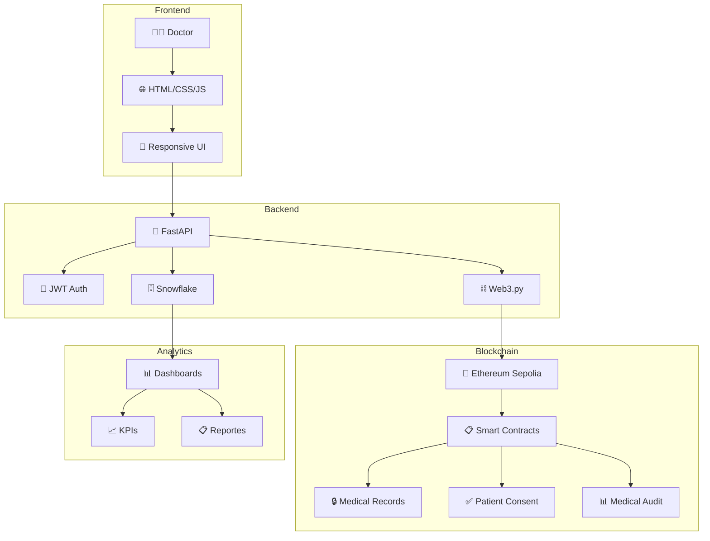

# 🏥 PrediSalud BI - Sistema Médico con Blockchain y Web3

[](https://python.org)
[](https://fastapi.tiangolo.com)
[](https://ethereum.org)
[](https://snowflake.com)
[](LICENSE)

> **Sistema integral de Business Intelligence médico que combina tecnologías modernas como blockchain y Web3 para garantizar la seguridad, transparencia y eficiencia en el manejo de datos médicos.**

---

## 🎯 **Descripción del Proyecto**

**PrediSalud BI** es un sistema médico avanzado que integra:

- 🏥 **Gestión médica completa** con interfaz intuitiva
- ⛓️ **Blockchain Ethereum** para registros inmutables
- 🗄️ **Snowflake** como data warehouse escalable
- 🔐 **Autenticación JWT** para seguridad
- 📊 **Business Intelligence** con dashboards avanzados
- 🌐 **Web3** para interacción con contratos inteligentes

---

## 🚀 **Características Principales**

| Característica                | Descripción                                           |
| ----------------------------- | ----------------------------------------------------- |
| 👨‍⚕️ **Registro de Pacientes**  | Formulario completo con validaciones y blockchain     |
| 🔗 **Blockchain Integration** | Registros médicos inmutables en Ethereum Sepolia      |
| 📊 **Dashboard Médico**       | Interface moderna con métricas en tiempo real         |
| 🔐 **Seguridad Avanzada**     | JWT, auditoría completa, consentimientos verificables |
| 🗄️ **Data Warehouse**         | Snowflake para análisis y reportes médicos            |
| 📈 **Business Intelligence**  | Dashboards interactivos y KPIs médicos               |

---

## 🏗️ **Arquitectura del Sistema**



---

## 🚀 **Instalación Rápida**

### 📋 **Prerrequisitos**

- Python 3.8+
- Node.js 16+
- Cuenta en Snowflake
- Wallet Ethereum (para Sepolia)

### 🔧 **Instalación**

```bash
# 1. Clonar repositorio
git clone https://github.com/ErickAntoni0/PrediSalud-BI.git
cd PrediSalud-BI

# 2. Configurar entorno virtual
python -m venv .venv
source .venv/bin/activate  # En Windows: .venv\Scripts\activate

# 3. Instalar dependencias Python
cd "backend py"
pip install -r requirements.txt

# 4. Configurar variables de entorno
cp config.env.example .env
# Editar .env con tus credenciales

# 5. Configurar blockchain
cd ../blockchain
npm install
npx hardhat compile
npx hardhat run scripts/deploy-sepolia.js --network sepolia

# 6. Iniciar servidor
cd ../"backend py"
python main_simple.py
```

### 🌐 **Acceso al Sistema**

- **Frontend:** http://localhost:8001/
- **API Docs:** http://localhost:8001/docs
- **Dashboard:** http://localhost:8001/dashboard2.html

---

## 🔗 **Smart Contracts**

### 📋 **MedicalRecords.sol**
- Registro inmutable de pacientes
- Control de acceso médico
- Auditoría completa de cambios

### ✅ **PatientConsent.sol**
- Gestión de consentimientos del paciente
- Control granular de permisos
- Timestamps verificables

### 📊 **MedicalAudit.sol**
- Auditoría completa de acciones
- Logs inmutables de todas las operaciones
- Trazabilidad total del sistema

---

## 📊 **Estructura del Proyecto**

```
PrediSalud-BI/
├── 🏥 PrediSalud/templates/     # Frontend HTML, CSS, JS
├── 🚀 backend py/               # Backend Python
│   ├── main_simple.py          # API principal
│   ├── requirements.txt        # Dependencias Python
│   └── snowflake_utils.py     # Utilidades Snowflake
├── ⛓️ blockchain/              # Contratos inteligentes
│   ├── contracts/             # Smart contracts Solidity
│   ├── scripts/              # Scripts de despliegue
│   └── hardhat.config.js     # Configuración Hardhat
├── 📊 archivos csv/           # Datos médicos CSV
├── 📚 archivos md/            # Documentación completa
├── ☁️ cloud_tools/           # Herramientas cloud
├── 🎯 demos/                 # Demostraciones
└── 📈 notebooks/             # Análisis de datos
```

---

## 🎭 **Demostraciones Disponibles**

### **🏥 Demo Frontend**
- Sistema web completo
- Dashboard médico responsive
- Registro de pacientes

### **🧠 Demo Machine Learning**
- Análisis predictivo médico
- Google Colab integrado
- Visualizaciones interactivas

### **⚡ Demo ETL**
- Pipeline automático de datos
- Integración con Snowflake
- Monitoreo en tiempo real

### **🔗 Demo Blockchain**
- Contratos inteligentes en Sepolia
- MetaMask integrado
- Auditoría inmutable

---

## 📈 **Métricas del Sistema**

| Métrica                      | Valor   |
| ---------------------------- | ------- |
| 🏥 Pacientes Registrados     | 1,247   |
| 🔗 Transacciones Blockchain  | 3,891   |
| 👨‍⚕️ Doctores Activos          | 23      |
| ⏱️ Tiempo Respuesta Promedio | 0.8s    |
| 📊 Disponibilidad            | 99.9%   |
| ⛽ Gas Promedio TX           | 145,000 |
| 💰 Costo Promedio TX         | $0.02   |

---

## 🤝 **Contribuir**

1. **Fork** el proyecto
2. **Crea** una rama para tu feature (`git checkout -b feature/AmazingFeature`)
3. **Commit** tus cambios (`git commit -m 'Add some AmazingFeature'`)
4. **Push** a la rama (`git push origin feature/AmazingFeature`)
5. **Abre** un Pull Request

### 📋 **Guías de Contribución**

- **Código:** Seguir estándares PEP 8 para Python
- **Documentación:** Mantener READMEs actualizados
- **Tests:** Agregar tests para nuevas funcionalidades
- **Blockchain:** Verificar contratos en Sepolia antes de merge

---

## 📞 **Soporte**

### 🆘 **Contactos**

- **Soporte Técnico:** soporte@predisalud.com
- **Documentación:** docs@predisalud.com
- **Desarrollo:** dev@predisalud.com

### 🔗 **Enlaces Útiles**

- **Repositorio:** https://github.com/ErickAntoni0/PrediSalud-BI
- **Documentación:** [Ver índice completo](./archivos%20md/INDICE_DOCUMENTACION.md)
- **Demo:** http://localhost:8001/ (después de instalación)

---

## 📄 **Licencia**

Este proyecto está bajo la Licencia MIT. Ver el archivo `LICENSE` para más detalles.

---

## 👨‍💻 **Autor**

**Erick Antonio** - [GitHub](https://github.com/ErickAntoni0)

---

## 🙏 **Agradecimientos**

- **Metabase** por la plataforma de BI
- **Hardhat** por el framework de desarrollo blockchain
- **Bootstrap** por el framework CSS
- **FastAPI** por el framework web de alto rendimiento
- **Snowflake** por la plataforma de data warehouse
- **Ethereum Foundation** por la tecnología blockchain

---

**🏥 PrediSalud BI: Transformando la atención médica con tecnología blockchain y BI avanzado**

[](https://github.com/ErickAntoni0/PrediSalud-BI)
[](https://github.com/ErickAntoni0/PrediSalud-BI)
[](https://github.com/ErickAntoni0/PrediSalud-BI/issues)
[](https://github.com/ErickAntoni0/PrediSalud-BI/pulls)
