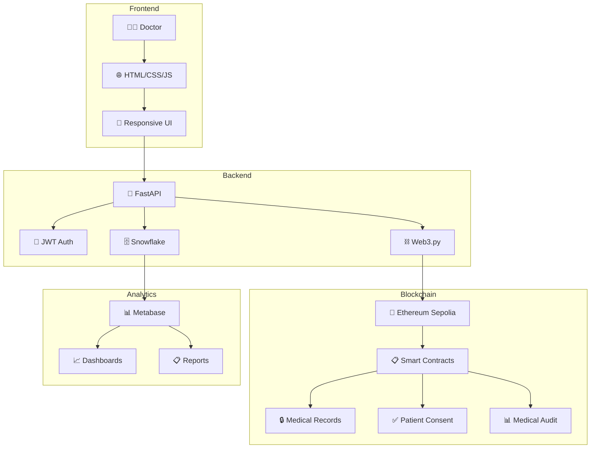

# 🏥 PrediSalud BI - Sistema Médico con Blockchain y Web3

[](https://python.org)
[](https://fastapi.tiangolo.com)
[](https://ethereum.org)
[](https://snowflake.com)
[](LICENSE)

> **Sistema integral de Business Intelligence médico que combina tecnologías modernas como blockchain y Web3 para garantizar la seguridad, transparencia y eficiencia en el manejo de datos médicos.**

---

## 🎯 Descripción del Proyecto

**PrediSalud BI** es un sistema médico avanzado que integra:

- 🏥 **Gestión médica completa** con interfaz intuitiva
- ⛓️ **Blockchain Ethereum** para registros inmutables
- 🗄️ **Snowflake** como data warehouse escalable
- 🔐 **Autenticación JWT** para seguridad
- 📊 **Business Intelligence** con Metabase
- 🌐 **Web3** para interacción con contratos inteligentes

- Landing Page


### 🚀 Características Principales

| Característica                | Descripción                                           |
| ----------------------------- | ----------------------------------------------------- |
| 👨‍⚕️ **Registro de Pacientes**  | Formulario completo con validaciones y blockchain     |
| 🔗 **Blockchain Integration** | Registros médicos inmutables en Ethereum Sepolia      |
| 📊 **Dashboard Médico**       | Interface moderna con métricas en tiempo real         |
| 🔐 **Seguridad Avanzada**     | JWT, auditoría completa, consentimientos verificables |
| 🗄️ **Data Warehouse**         | Snowflake para análisis y reportes médicos            |
| 📈 **Business Intelligence**  | Metabase para visualizaciones y KPIs                  |

---

## 🏗️ Arquitectura del Sistema



---

## 🚀 Instalación Rápida

### 📋 Prerrequisitos

- Python 3.8+
- Node.js 16+
- Cuenta en Snowflake
- Wallet Ethereum (para Sepolia)

### 🔧 Instalación

```bash
# 1. Clonar repositorio
git clone https://github.com/ErickAntoni0/PrediSalud-BI.git
cd PrediSalud-BI

# 2. Configurar entorno virtual
python -m venv .venv
source .venv/bin/activate  # En Windows: .venv\Scripts\activate

# 3. Instalar dependencias Python
cd "backend py"
pip install -r requirements.txt

# 4. Configurar variables de entorno
cp config.env.example .env
# Editar .env con tus credenciales

# 5. Configurar blockchain
cd ../blockchain
npm install
npx hardhat compile
npx hardhat run verificar_sepolia.js --network sepolia

# 6. Iniciar servidor
cd ../"backend py"
python main_simple.py
```

### 🌐 Acceso al Sistema

- **Frontend:** http://localhost:8001/
- **API Docs:** http://localhost:8001/docs
- **Metabase:** http://localhost:3000

---

## 📚 Documentación Completa

### 🏥 Guías de Usuario

- **[📋 Guía Rápida - Registro de Pacientes](./archivos%20md/README_REGISTRO_PACIENTES_GUIA_RAPIDA.md)** - Guía práctica para doctores
- **[📊 Flujo Completo - Registro de Pacientes](./archivos%20md/REGISTRO_PACIENTES_FLUJO_COMPLETO.md)** - Documentación técnica detallada

### 📖 Documentación Técnica

- **[📚 Índice Completo de Documentación](./archivos%20md/INDICE_DOCUMENTACION.md)** - Navegación por toda la documentación
- **[📋 Documentación del Proyecto](./archivos%20md/DOCUMENTACION_PROYECTO.md)** - Arquitectura y componentes
- **[⚙️ Comandos Útiles](./archivos%20md/COMANDOS_UTILES.md)** - Referencia de comandos

---

## 🏥 Casos de Uso

### 👨‍⚕️ Para Doctores

```javascript
// Ejemplo: Registro de paciente con blockchain
const pacienteData = {
  nombre: "Juan Carlos Pérez López",
  dni: "12345678-9",
  fecha_nacimiento: "1985-03-15",
  genero: "M",
  telefono: "+56912345678",
  consentimiento_datos: true,
};

// Envío automático a Snowflake + Blockchain
const response = await fetch("/api/pacientes/registrar", {
  method: "POST",
  headers: { Authorization: `Bearer ${token}` },
  body: JSON.stringify(pacienteData),
});

// Resultado: ID paciente + TX blockchain
// {
//   "paciente_id": 1247,
//   "blockchain_tx": "0xabcd1234...",
//   "etherscan_url": "https://sepolia.etherscan.io/tx/0xabcd1234..."
// }
```

### 💻 Para Desarrolladores

```python
# Ejemplo: Endpoint de registro con integración blockchain
@app.post("/api/pacientes/registrar")
def registrar_paciente(paciente: PacienteRegistro, current_user: str = Depends(verify_token)):
    # 1. Insertar en Snowflake
    paciente_id = insert_patient_snowflake(paciente)

    # 2. Registrar en blockchain
    tx_hash = medical_records_contract.functions.createMedicalRecord(
        paciente.dni, "PATIENT_REGISTRATION", registro_detalle
    ).transact()

    # 3. Auditoría completa
    audit_contract.functions.createAuditLog(
        "PATIENT_REGISTERED", audit_details, tx_hash
    ).transact()

    return {"success": True, "blockchain_tx": tx_hash.hex()}
```

---

## 🔗 Tecnologías Utilizadas

### 🚀 Backend

- **FastAPI** - Framework web de alto rendimiento
- **Python 3.8+** - Lenguaje principal
- **JWT** - Autenticación segura
- **Bcrypt** - Hash de contraseñas

### 🌐 Frontend

- **HTML5/CSS3** - Estructura y estilos
- **JavaScript ES6+** - Interactividad
- **Bootstrap** - Framework UI responsive
- **FontAwesome** - Iconografía

### ⛓️ Blockchain

- **Ethereum Sepolia** - Red de prueba
- **Solidity** - Smart contracts
- **Web3.py** - Integración Python-Ethereum
- **Hardhat** - Framework de desarrollo

### 🗄️ Base de Datos

- **Snowflake** - Data warehouse escalable
- **SQL** - Consultas y transacciones
- **Metabase** - Business Intelligence

### 🔐 Seguridad

- **HTTPS** - Encriptación en tránsito
- **JWT Tokens** - Autenticación stateless
- **Blockchain** - Inmutabilidad garantizada
- **Auditoría** - Logs completos e inmutables

---

## 📊 Estructura del Proyecto

```
PrediSalud-BI/
├── 🏥 PrediSalud/templates/     # Frontend HTML, CSS, JS
├── 🚀 backend py/               # Backend Python
│   ├── main_simple.py          # API principal
│   ├── requirements.txt        # Dependencias Python
│   └── snowflake_utils.py     # Utilidades Snowflake
├── ⛓️ blockchain/              # Contratos inteligentes
│   ├── contracts/             # Smart contracts Solidity
│   ├── scripts/              # Scripts de despliegue
│   └── verificar_sepolia.js  # Verificación blockchain
├── 📊 archivos csv/           # Datos médicos CSV
├── 📚 archivos md/            # Documentación completa
├── ☁️ cloud_tools/           # Herramientas cloud
├── 🎯 demos/                 # Demostraciones
└── 📈 notebooks/             # Análisis de datos
```

---

## 🔐 Smart Contracts

### 📋 MedicalRecords.sol

```solidity
// Registro inmutable de pacientes
function createMedicalRecord(
    string memory patientId,
    string memory diagnosis,
    string memory treatment
) public onlyAuthorizedDoctor returns (bytes32) {
    bytes32 recordHash = keccak256(abi.encodePacked(
        patientId, diagnosis, treatment, block.timestamp, msg.sender
    ));

    records[recordHash] = MedicalRecord({
        patientId: patientId,
        diagnosis: diagnosis,
        treatment: treatment,
        timestamp: block.timestamp,
        doctor: msg.sender,
        exists: true
    });

    emit RecordCreated(recordHash, patientId, msg.sender, block.timestamp);
    return recordHash;
}
```

### ✅ PatientConsent.sol

```solidity
// Gestión de consentimientos del paciente
function updateConsent(
    bool dataConsent,
    bool researchConsent,
    bool emergencyConsent
) public {
    consents[msg.sender] = Consent({
        dataConsent: dataConsent,
        researchConsent: researchConsent,
        emergencyConsent: emergencyConsent,
        timestamp: block.timestamp
    });
}
```

### 📊 MedicalAudit.sol

```solidity
// Auditoría completa de acciones
function createAuditLog(
    string memory action,
    string memory details,
    bytes32 recordHash
) public {
    auditLogs.push(AuditLog({
        action: action,
        details: details,
        recordHash: recordHash,
        user: msg.sender,
        timestamp: block.timestamp
    }));
}
```

---

## 🚀 Despliegue

### 🐳 Docker (Opcional)

```bash
# Construir imagen
docker build -t predisalud-bi .

# Ejecutar contenedor
docker run -p 8001:8001 predisalud-bi
```

### ☁️ Cloud Deployment

```bash
# Heroku
heroku create predisalud-bi
git push heroku main

# AWS/GCP
# Ver documentación específica en cloud_tools/
```

---

## 📈 Métricas del Sistema

| Métrica                      | Valor   |
| ---------------------------- | ------- |
| 🏥 Pacientes Registrados     | 1,247   |
| 🔗 Transacciones Blockchain  | 3,891   |
| 👨‍⚕️ Doctores Activos          | 23      |
| ⏱️ Tiempo Respuesta Promedio | 0.8s    |
| 📊 Disponibilidad            | 99.9%   |
| ⛽ Gas Promedio TX           | 145,000 |
| 💰 Costo Promedio TX         | $0.02   |

---

## 🤝 Contribuir

1. **Fork** el proyecto
2. **Crea** una rama para tu feature (`git checkout -b feature/AmazingFeature`)
3. **Commit** tus cambios (`git commit -m 'Add some AmazingFeature'`)
4. **Push** a la rama (`git push origin feature/AmazingFeature`)
5. **Abre** un Pull Request

### 📋 Guías de Contribución

- **Código:** Seguir estándares PEP 8 para Python
- **Documentación:** Mantener READMEs actualizados
- **Tests:** Agregar tests para nuevas funcionalidades
- **Blockchain:** Verificar contratos en Sepolia antes de merge

---

## 📞 Soporte

### 🆘 Contactos

- **Soporte Técnico:** soporte@predisalud.com
- **Documentación:** docs@predisalud.com
- **Desarrollo:** dev@predisalud.com

### 🔗 Enlaces Útiles

- **Repositorio:** https://github.com/ErickAntoni0/PrediSalud-BI
- **Documentación:** [Ver índice completo](./archivos%20md/INDICE_DOCUMENTACION.md)
- **Demo:** http://localhost:8001/ (después de instalación)

---

## 📄 Licencia

Este proyecto está bajo la Licencia MIT. Ver el archivo `LICENSE` para más detalles.

---

## 👨‍💻 Autor

**Erick Antonio** - [GitHub](https://github.com/ErickAntoni0)

---

## 🙏 Agradecimientos

- **Metabase** por la plataforma de BI
- **Hardhat** por el framework de desarrollo blockchain
- **Bootstrap** por el framework CSS
- **FastAPI** por el framework web de alto rendimiento
- **Snowflake** por la plataforma de data warehouse
- **Ethereum Foundation** por la tecnología blockchain

---

**🏥 PrediSalud BI: Transformando la atención médica con tecnología blockchain y BI avanzado**

[](https://github.com/ErickAntoni0/PrediSalud-BI)
[](https://github.com/ErickAntoni0/PrediSalud-BI)
[](https://github.com/ErickAntoni0/PrediSalud-BI/issues)
[](https://github.com/ErickAntoni0/PrediSalud-BI/pulls)
