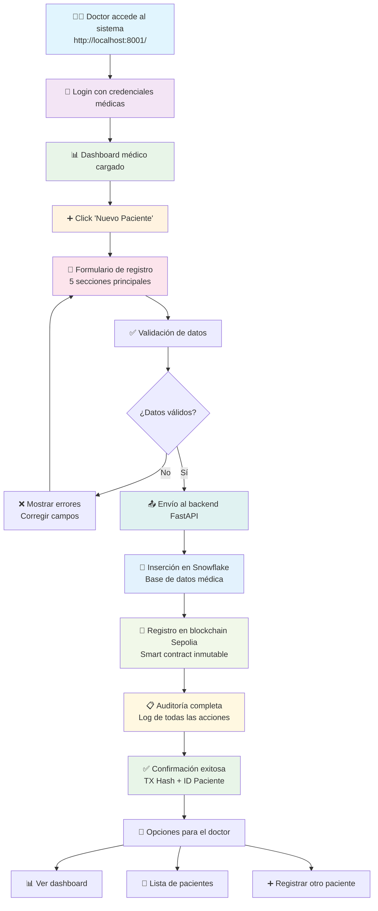

# 🏥 GUÍA RÁPIDA: Registro de Pacientes

## 📋 Resumen para Doctores

Esta guía explica **paso a paso** cómo registrar un paciente nuevo en el sistema PrediSalud, desde la perspectiva del doctor.

## 🎯 Diagrama de Flujo Visual



---

## 🔐 1. Acceso al Sistema

### ➡️ Proceso del Doctor:

1. **Abrir navegador** → `http://localhost:8001/`
2. **Click** "Inicia Sesión"
3. **Ingresar credenciales** médicas
4. **Verificar** estado blockchain (🟢 = conectado)

### 🖥️ Lo que ve el doctor:

```
┌─────────────────────────────────────┐
│  🏥 PrediSalud - Sistema Médico     │
│                                     │
│  👤 Usuario: [________]             │
│  🔒 Password: [________]            │
│                                     │
│  [🔐 Iniciar Sesión]               │
│                                     │
│  🔗 Blockchain: ✅ Conectado       │
└─────────────────────────────────────┘
```

---

## 📊 2. Dashboard Médico

### ➡️ Después del login exitoso:

- **Redirección automática** al dashboard
- **Verificación** de autenticación
- **Carga** de información del doctor

### 🖥️ Interface principal:

```
┌─────────────────────────────────────┐
│  👨‍⚕️ Dr. Juan Pérez - Medicina Interna │
│  🟢 En línea                        │
│                                     │
│  📊 Dashboard Principal             │
│  👥 Gestión de Pacientes           │
│  🗄️ Base de Datos Médica           │
│  📈 Analíticas Médicas             │
│                                     │
│  [➕ Nuevo Paciente]               │
│  [📅 Nueva Cita]                   │
│  [📋 Nuevo Diagnóstico]            │
│                                     │
│  🔗 Blockchain: ✅ Conectado       │
│  🗄️ Snowflake: ✅ Conectado        │
└─────────────────────────────────────┘
```

---

## 📝 3. Formulario de Registro

### ➡️ Click "Nuevo Paciente":

- **Redirección** a `/registro_pacientes.html`
- **Carga** formulario médico completo
- **Validaciones** automáticas activas

### 📋 Secciones del formulario:

#### 1️⃣ **Datos Básicos** (Obligatorios)

- 👤 **Nombre completo**
- 🆔 **DNI/Cédula** (formato: 12345678-9)
- 🎂 **Fecha nacimiento**
- ⚧ **Género**
- 📞 **Teléfono**
- 📧 **Email** (opcional)

#### 2️⃣ **Información Contacto**

- 🏠 **Dirección completa**
- 🏙️ **Ciudad**
- 📮 **Código postal**

#### 3️⃣ **Información Médica**

- 🩸 **Grupo sanguíneo**
- 🚨 **Alergias conocidas**
- 💊 **Medicamentos actuales**
- 📋 **Antecedentes médicos**

#### 4️⃣ **Contacto Emergencia**

- 👤 **Nombre contacto**
- 👨‍👩‍👧‍👦 **Relación (cónyuge, hijo, etc.)**
- 📞 **Teléfono emergencia**

#### 5️⃣ **Consentimientos** (Crítico)

- ✅ **Tratamiento datos** (OBLIGATORIO)
- 🚨 **Acceso emergencia** (opcional)
- 🔬 **Investigación médica** (opcional)

---

## 🔄 4. Proceso de Envío

### ➡️ Al hacer click "Registrar Paciente":

```
1. ✅ Validación formulario
   ↓
2. 📤 Envío a backend (FastAPI)
   ↓
3. 💾 Inserción en Snowflake
   ↓
4. 🔗 Registro en blockchain (Sepolia)
   ↓
5. 📋 Auditoría completa
   ↓
6. ✅ Confirmación al doctor
```

### 🖥️ Indicadores visuales:

```
⏳ Guardando en Snowflake...
🔗 Registrando en blockchain...
✅ Paciente registrado exitosamente
```

---

## ✅ 5. Confirmación Exitosa

### 📋 Información que recibe el doctor:

```
✅ PACIENTE REGISTRADO EXITOSAMENTE

📋 Información del Registro:
• ID Paciente: 1247
• Nombre: Juan Carlos Pérez López
• DNI: 12345678-9

🔗 Información Blockchain:
• TX Hash: 0xabcd1234...
• Bloque: 5,847,291
• Estado: ✅ Verificado

👨‍⚕️ Registrado por:
• Doctor: dr.juan.perez
• Fecha: 29/07/2024 14:30:15

🔍 Ver en Etherscan:
https://sepolia.etherscan.io/tx/0xabcd1234...
```

### 🔄 Opciones post-registro:

- **Ver lista pacientes** → `/table-databases.html`
- **Registrar otro paciente** → Limpiar formulario
- **Ver dashboard** → `/dashboard2.html`

---

## 🛡️ 6. Seguridad y Auditoría

### 🔒 Medidas de seguridad:

- **Token JWT** con expiración automática
- **Verificación de rol** médico
- **Validación de datos** cliente y servidor
- **Encriptación HTTPS** en todas las comunicaciones

### 📋 Auditoría automática:

- **Login del doctor** → Registrado en blockchain
- **Registro del paciente** → Inmutable en Sepolia
- **Accesos a datos** → Trazabilidad completa
- **Consentimientos** → Verificables públicamente

---

## 🔧 7. Resolución de Problemas

### ❌ Errores Comunes:

#### **"DNI ya existe"**

- **Solución:** Verificar que el paciente no esté registrado
- **Acción:** Buscar en base de datos médica

#### **"Blockchain desconectado"**

- **Solución:** Verificar conexión a internet
- **Acción:** Contactar administrador del sistema

#### **"Sesión expirada"**

- **Solución:** Volver a hacer login
- **Acción:** Guardar trabajo en borrador si es posible

#### **"Error validación formulario"**

- **Solución:** Revisar campos obligatorios
- **Acción:** Completar campos marcados en rojo

### 🔄 Acciones de recuperación:

```javascript
// Si hay error, el formulario mantiene los datos ingresados
// Se puede usar "Guardar Borrador" para no perder información
// El sistema sugiere automáticamente correcciones
```

---

## 📞 8. Soporte y Contacto

### 🆘 En caso de problemas técnicos:

- **Administrador del sistema:** ext. 123
- **Soporte IT:** soporte@predisalud.com
- **Documentación completa:** `REGISTRO_PACIENTES_FLUJO_COMPLETO.md`

### 🎯 Funcionalidades adicionales disponibles:

- **Búsqueda de pacientes** → Barra de búsqueda por DNI/nombre
- **Edición de datos** → Botón "Editar" en lista de pacientes
- **Verificación blockchain** → Click en estado blockchain
- **Reportes médicos** → Sección "Analíticas Médicas"
- **Gestión de citas** → Botón "Nueva Cita"

---

## 🏆 Beneficios del Sistema

### ✅ Para el Doctor:

- **Interface intuitiva** sin curva de aprendizaje
- **Validaciones automáticas** evitan errores
- **Respaldo blockchain** garantiza integridad
- **Auditoría transparente** para reguladores

### ✅ Para el Paciente:

- **Datos seguros** e inmutables
- **Consentimientos claros** y revocables
- **Portabilidad** entre centros médicos
- **Transparencia** en el uso de información

### ✅ Para la Institución:

- **Cumplimiento automático** de regulaciones
- **Eficiencia operativa** mejorada
- **Reducción de riesgos** legales
- **Escalabilidad** sin límites técnicos

---

**🏥 ¡El sistema está listo para uso inmediato por personal médico profesional!**
