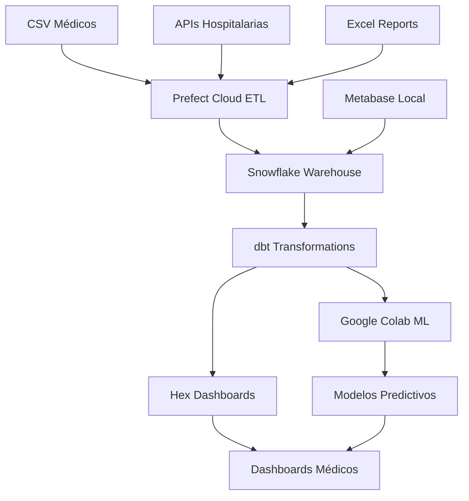

# 🌩️ Guía Completa de Herramientas Cloud para PrediSalud

## 🎯 Reemplazo de Orange y Apache NiFi

Esta guía te ayuda a configurar herramientas modernas en la nube para **minería de datos** y **ETL**, específicamente diseñadas para el sistema PrediSalud.

---

## 📊 MINERÍA DE DATOS EN LA NUBE

### 1. 🥇 **Google Colab + Jupyter** (RECOMENDADO)

#### ✅ **Ventajas:**

- **100% Gratis** con GPU incluida
- **0 Instalación** - Solo navegador
- **Colaborativo** - Equipo médico puede acceder
- **Integración directa** con Snowflake
- **Librerías médicas** preinstaladas

#### 🚀 **Configuración Inmediata:**

```python
# 1. Ir a https://colab.research.google.com
# 2. Crear nuevo notebook
# 3. Pegar este código:

# Instalar dependencias
!pip install snowflake-connector-python[pandas] plotly scikit-learn

# Conectar a Snowflake
import snowflake.connector
import pandas as pd

# Tu código de análisis médico aquí...
```

#### 📋 **Casos de Uso para PrediSalud:**

- ✅ Análisis predictivo de diabetes
- ✅ Modelos de éxito de tratamientos
- ✅ Visualizaciones médicas interactivas
- ✅ Dashboards para médicos

---

### 2. 🎨 **Hex.tech** - Analytics Colaborativo

#### ✅ **Ventajas:**

- **SQL + Python + Dashboards** en uno
- **Interfaz visual** fácil para médicos
- **Colaboración en tiempo real**
- **Conecta directo a Snowflake**

#### 🔗 **Setup:**

```bash
1. Ir a https://hex.tech
2. Crear cuenta gratuita
3. Conectar a Snowflake
4. Importar datos médicos
5. Crear análisis visuales
```

#### 💰 **Pricing:**

- **Gratis**: 3 usuarios, proyectos ilimitados
- **Pro**: $50/mes por usuario (para equipos grandes)

---

### 3. 📈 **Deepnote** - Jupyter Colaborativo

#### ✅ **Ventajas:**

- **Jupyter mejorado** en la nube
- **Colaboración en vivo**
- **Integración nativa** con Snowflake
- **Comentarios y reviews** en notebooks

#### 🔗 **Setup:**

```bash
1. Ir a https://deepnote.com
2. Crear cuenta con Google/GitHub
3. Crear proyecto "PrediSalud Analytics"
4. Conectar a Snowflake
5. Importar notebook médico
```

#### 💰 **Pricing:**

- **Gratis**: 750 horas/mes de compute
- **Team**: $20/mes por usuario

---

## ⚡ ETL EN LA NUBE

### 1. 🥇 **Prefect Cloud** (RECOMENDADO)

#### ✅ **Ventajas:**

- **Más fácil** que Apache NiFi
- **UI moderna** y intuitiva
- **Monitoreo en tiempo real**
- **Reintentos automáticos**
- **Escalabilidad automática**

#### 🚀 **Configuración:**

```bash
# Instalar Prefect
pip install prefect

# Autenticarse
prefect cloud login

# Crear primer pipeline
python cloud_tools/prefect_etl_setup.py
```

#### 📊 **Pipeline Médico Ejemplo:**

```python
@flow
def pipeline_medico_predisalud():
    # 1. Extraer CSV médicos
    data = extract_csv("pacientes.csv")

    # 2. Limpiar y validar
    clean_data = validate_medical_data(data)

    # 3. Cargar a Snowflake
    load_to_snowflake(clean_data, "pacientes")
```

#### 💰 **Pricing:**

- **Gratis**: 20,000 task runs/mes
- **Pro**: $39/mes por usuario

---

### 2. 🔄 **dbt Cloud** - Transformaciones SQL

#### ✅ **Ventajas:**

- **Solo SQL** - Fácil para analistas
- **Documentación automática**
- **Testing de datos** integrado
- **Perfecto para Snowflake**

#### 🚀 **Configuración:**

```sql
-- models/patient_analytics.sql
SELECT
    patient_id,
    age,
    CASE
        WHEN bmi > 30 THEN 'Obesidad'
        WHEN bmi > 25 THEN 'Sobrepeso'
        ELSE 'Normal'
    END as bmi_category,
    has_diabetes,
    has_hypertension
FROM {{ ref('raw_patients') }}
WHERE age BETWEEN 18 AND 100
```

#### 🔗 **Setup:**

```bash
1. Ir a https://getdbt.com
2. Crear cuenta
3. Conectar a Snowflake
4. Crear proyecto "PrediSalud"
5. Escribir transformaciones médicas
```

#### 💰 **Pricing:**

- **Developer**: Gratis para 1 usuario
- **Team**: $100/mes para 5+ usuarios

---

### 3. 🌊 **Fivetran + Snowflake**

#### ✅ **Ventajas:**

- **ETL automático** desde múltiples fuentes
- **Conectores médicos** especializados
- **Sincronización en tiempo real**
- **Monitoreo y alertas**

#### 🔗 **Setup:**

```bash
1. Ir a https://fivetran.com
2. Crear cuenta
3. Configurar conectores:
   - CSV/Excel médicos
   - APIs hospitalarias
   - Bases de datos legacy
4. Todo se sincroniza a Snowflake automáticamente
```

#### 💰 **Pricing:**

- **Starter**: $120/mes (500k filas)
- **Standard**: $180/mes (1M filas)

---

## 🏗️ ARQUITECTURA RECOMENDADA PARA PREDISALUD



---

## 💰 COMPARATIVA DE COSTOS

| Herramienta        | Costo Mensual | Capacidad           | Uso PrediSalud      |
| ------------------ | ------------- | ------------------- | ------------------- |
| **Google Colab**   | $0            | Ilimitado           | ✅ Análisis ML      |
| **Prefect Cloud**  | $0-39         | 20k tasks           | ✅ ETL Principal    |
| **dbt Cloud**      | $0-100        | 1-5 usuarios        | ✅ Transformaciones |
| **Hex**            | $0-50         | 3+ usuarios         | ⭐ Dashboards       |
| **Deepnote**       | $0-20         | 750h compute        | ⭐ Colaboración     |
| **Fivetran**       | $120+         | 500k+ filas         | ⭐ ETL Avanzado     |
| **VS Orange/NiFi** | $0            | **Muchos recursos** | ❌ Complejo         |

---

## 🎯 PLAN DE IMPLEMENTACIÓN PARA PREDISALUD

### **Fase 1: Setup Básico (1 semana)**

```bash
✅ Configurar Google Colab
✅ Conectar Colab a Snowflake
✅ Crear primer notebook de análisis
✅ Configurar Prefect Cloud
✅ Crear pipeline ETL básico
```

### **Fase 2: ETL Automático (2 semanas)**

```bash
✅ Configurar dbt Cloud
✅ Crear transformaciones médicas
✅ Automatizar carga de CSVs
✅ Configurar monitoreo
✅ Testing de pipelines
```

### **Fase 3: Analytics Avanzado (2 semanas)**

```bash
✅ Modelos predictivos en Colab
✅ Dashboards en Hex/Deepnote
✅ Alertas médicas automáticas
✅ Integración con blockchain
✅ Documentación completa
```

---

## 🚀 COMANDOS DE INICIO RÁPIDO

### **1. Configurar Google Colab**

```python
# Abrir https://colab.research.google.com
# Subir notebook: notebooks/PrediSalud_Medical_Analytics.ipynb
# Ejecutar todas las celdas
```

### **2. Configurar Prefect Cloud**

```bash
pip install prefect
prefect cloud login
python cloud_tools/prefect_etl_setup.py
```

### **3. Probar ETL Local**

```bash
cd cloud_tools
python prefect_etl_setup.py
```

---

## 🎯 BENEFICIOS VS ORANGE/NIFI

| Aspecto           | Orange/NiFi       | Herramientas Cloud |
| ----------------- | ----------------- | ------------------ |
| **Setup**         | Horas/Días        | ✅ Minutos         |
| **Recursos**      | GPU/RAM Alto      | ✅ Automático      |
| **Mantenimiento** | Manual            | ✅ Automático      |
| **Colaboración**  | Limitada          | ✅ Nativa          |
| **Escalabilidad** | Manual            | ✅ Automática      |
| **Costos**        | Hardware + Tiempo | ✅ Pay-per-use     |
| **Integración**   | Compleja          | ✅ APIs simples    |
| **Monitoreo**     | Manual            | ✅ Dashboards      |

---

## 🎉 RESULTADO FINAL

Con esta configuración cloud, PrediSalud tendrá:

### ✅ **Minería de Datos:**

- 🧠 **Machine Learning médico** en Google Colab
- 📊 **Dashboards interactivos** en Hex
- 🔍 **Análisis colaborativo** en Deepnote
- 📈 **Visualizaciones** especializadas para salud

### ✅ **ETL Automático:**

- ⚡ **Pipelines automáticos** con Prefect
- 🔄 **Transformaciones SQL** con dbt
- 📥 **Carga en tiempo real** a Snowflake
- 🚨 **Alertas y monitoreo** automático

### 🎯 **Ventajas Finales:**

- 💰 **Costo mucho menor** que infraestructura local
- ⚡ **Velocidad de setup** en minutos vs días
- 🔧 **Mantenimiento automático**
- 👥 **Colaboración del equipo médico**
- 📱 **Acceso desde cualquier lugar**

---

## 📞 ¿LISTO PARA EMPEZAR?

1. **🚀 Empezar con Google Colab**: [notebooks/PrediSalud_Medical_Analytics.ipynb](notebooks/PrediSalud_Medical_Analytics.ipynb)
2. **⚡ Configurar Prefect ETL**: [cloud_tools/prefect_etl_setup.py](cloud_tools/prefect_etl_setup.py)
3. **📊 Crear Dashboards**: https://hex.tech o https://deepnote.com

**¡Tu sistema PrediSalud será mucho más potente que Orange + NiFi, con menos complejidad!** 🎉
